# Aura - Kahoot! App

For this project, I've decided to make a replica of my favorite class quiz app called Kahoot!. Using the MERN Stack (MongoDB, Express, React, & NodeJS) this quiz application interacts with a database, contains models & controllers, and even can be played with other devices so long as they join the PIN code.


<p align="center">
    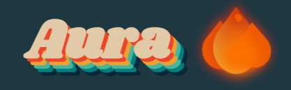
</p>

Below are some snapshots for how the game would look when (forked &) cloned. Instructions on how to install are also listed below. 

## Snapshots 

|Main Menu|Quiz Questions|
|---------|------------|
|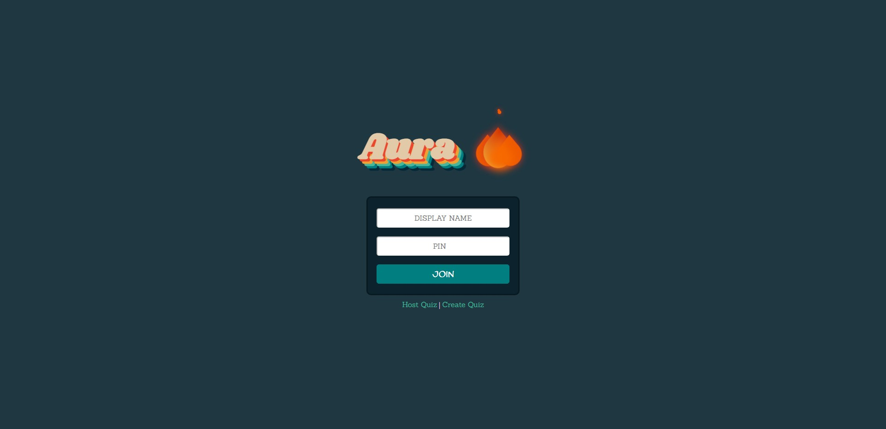|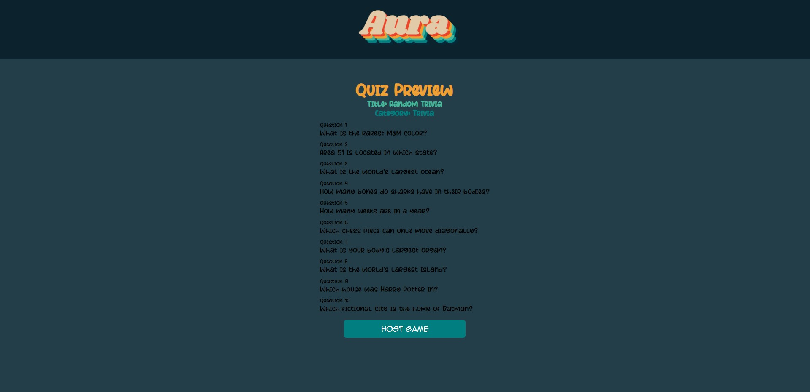|

|Host Lobby|Player Lobby|
|---------|------------|
|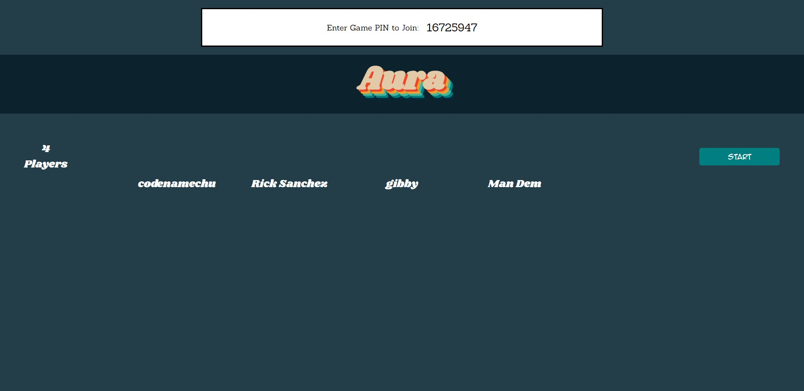|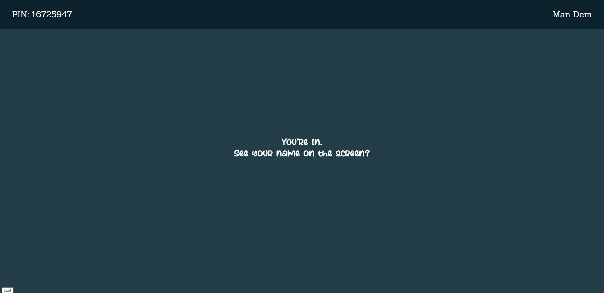|

|Game Preview|Question Preview|
|---------|------------|
|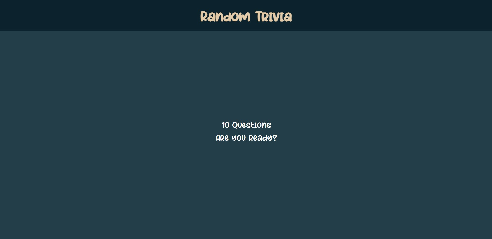|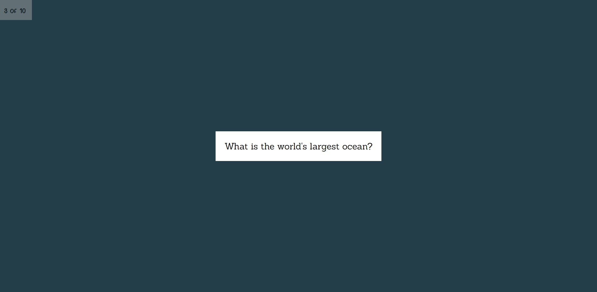|

|Question Board|Answer Board|
|---------|------------|
|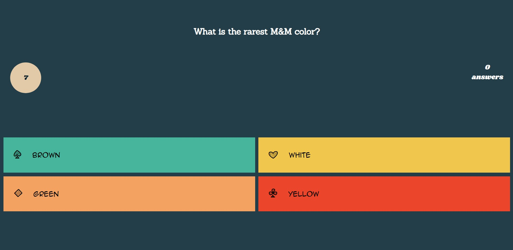|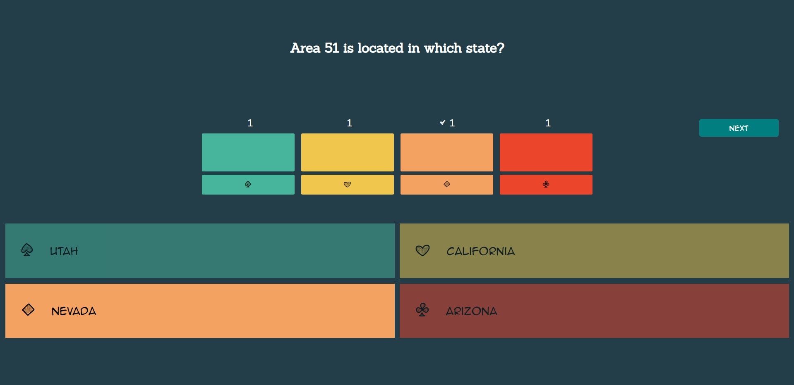|

|Player Answer| Scoreboard|
|---------|------------|
|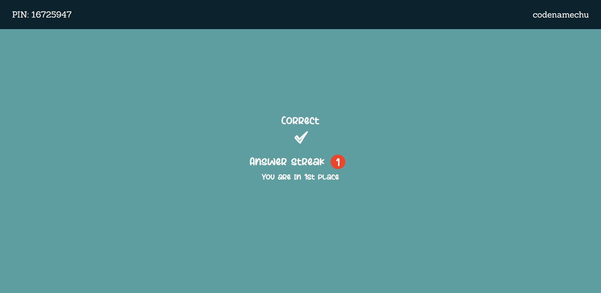|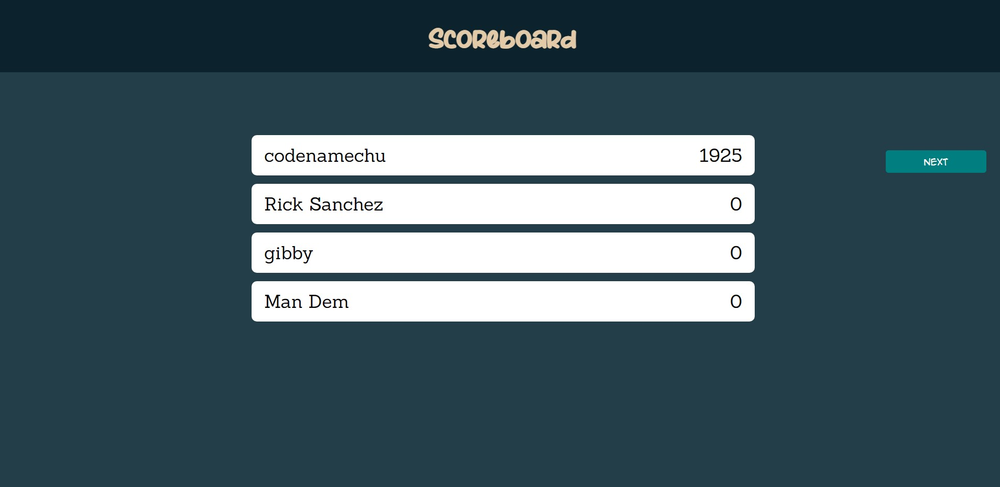|

|Leaderboard|
|-----------|
|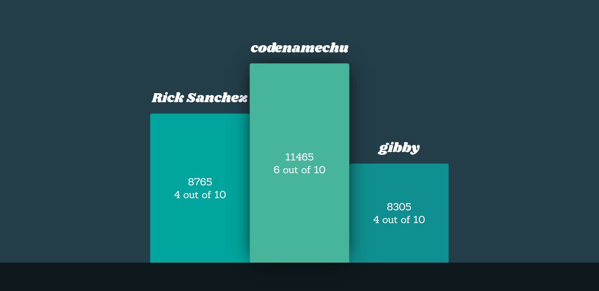|

## Built With

[](https://www.mongodb.com/)

[](https://expressjs.com/)

[](https://reactjs.org/) 

[](https://nodejs.org/en/)

[](https://www.npmjs.com/)

[](https://socket.io/docs/v4/)

## Installation

First, head to my backend server:

* [Backend Server](https://github.com/Chudii/aura-server) 

Clone this repository. This is the server that will allow you to access the important data. You will need `node` installed

```
git clone https://github.com/Chudii/aura-server.git
```
Go to the project directory
```
cd <project-name>
```
Then install the NPM packages
```
npm install
```
To Start Server:
```
npm run start
```

THEN...

Repeat the same steps for this repository. Once completed you should have both the server and the client running simultaenously.

To Visit App: 
`http://localhost:3000`

---

### Environmental Variables

To run this project, you will need to add the following environment variables to your `.env` file

A `PORT` & `MONGO_URI`.

---

### Feel free to contribute!

## Contact

[](https://www.linkedin.com/in/chudi-ibida/)

[](https://github.com/Chudii)

## Acknowledgements, References & Tools

[Fire Animation](https://codepen.io/yamanda/pen/RpNMaY) - For Fire Logo


[Uno](https://github.com/mizanxali/uno-online) - For Socket.io Logic


[Quizy](https://github.com/jeffreyquan/quizy-server) - For Kahoot Logic